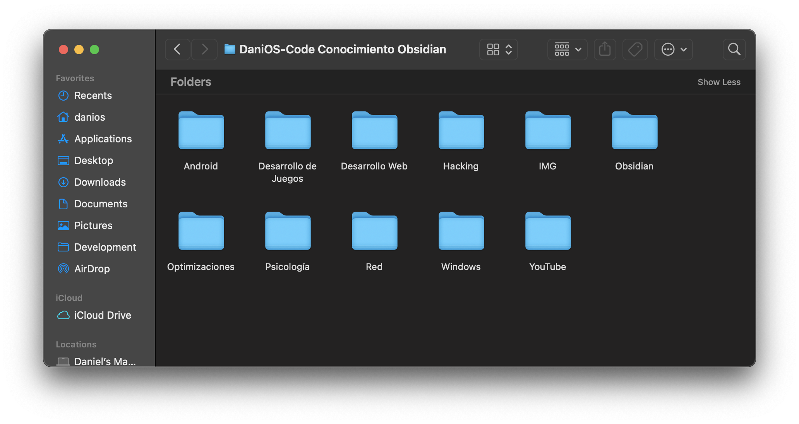
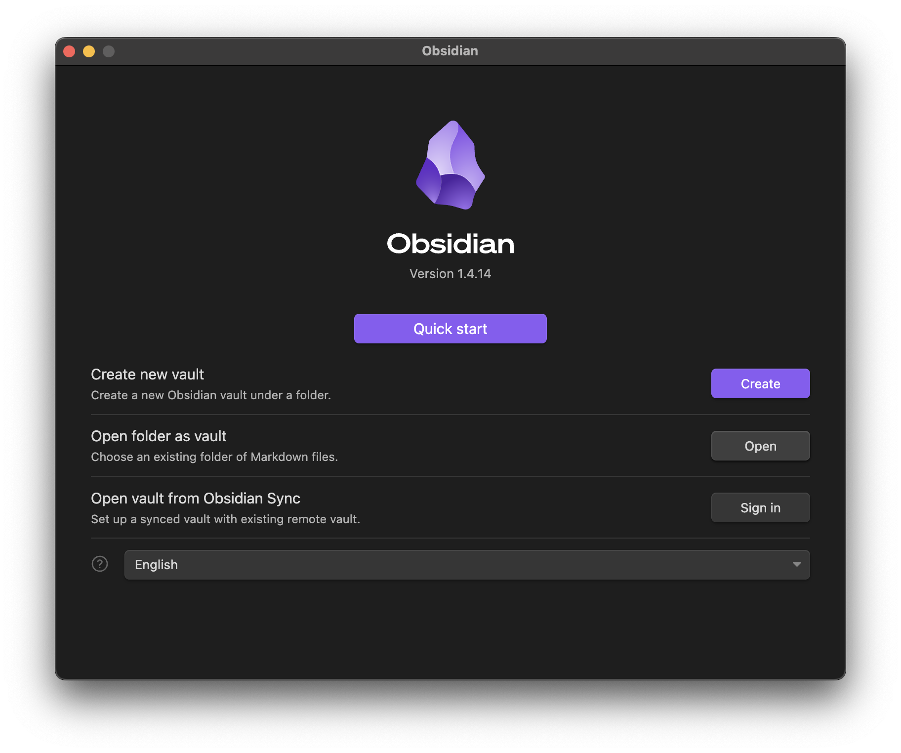

# 
Hi, I'm Daniel and this Drive file are my Obsidian Knowledge

> Here are the steps to follow:

[comment]: <> (Drive Obsidian File v1.0.0 [Oct/5/2023] )
- First, you need to download the [**Drive File**](https://drive.google.com/file/d/1eyUpR-a4_vMgGidbfaZTTmw0i4RZGqv8/view?usp=drive_link)

- Then, you need to unzip the _`.zip`_ file

- Now, you need to go to the [**Obsidian**](https://obsidian.md/download) application and download it

- Then, you need to open the application and click on _`Open folder as vault`_

