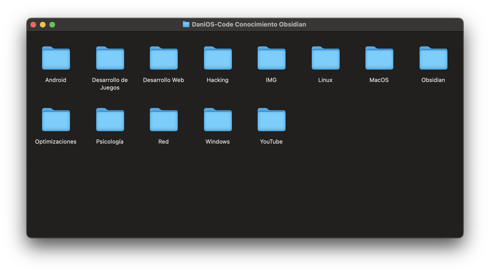

<div align="center">

</div>

# <div align="center">Hi, I'm Daniel and this Drive file are my Obsidian Knowledge</div>

> Here are the steps to follow:

[comment]: <> (Drive Obsidian File v1.0.0 [Oct/5/2023] )
- First, you need to clone & download the **File** via _`git`_

``` git
git clone https://github.com/DaniOS-Code/Obsidian_Knowledge.git
```

<div align="center">

</div>

- Now, you need to go to the [**Obsidian**](https://obsidian.md/download) application and download it

- Then, you need to open the application and click on _`Open folder as vault`_

<div align="center">

</div>

- Finally, select the folder and _`open`_ it.

